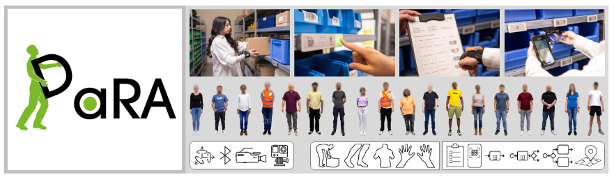

# Data4Sim

## Abstract

Understanding human movement in industrial environments requires more than 1
simple step counts—it demands contextual information to interpret activities and enhance 2
workflows. Key factors such as location and process context are essential. However, 3
research on context-sensitive human activity recognition is limited by the lack of publicly 4
available datasets that include both human movement and contextual labels. Our work 5
introduces the DaRA dataset to address this research gap. DaRA comprises over 109 6
hours of video footage, including 32 hours from wearable first-person cameras and 77 7
hours from fixed third-person cameras. In a laboratory environment replicating a realistic 8
warehouse, scenarios such as order-picking, packaging, unpacking, and storage were 9
captured. The movements of 18 subjects were captured using inertial measurement units, 10
Bluetooth devices for indoor localization, wearable first-person cameras, and fixed third- 11
person cameras. DaRA offers detailed annotations with 12 class categories and 207 class 12
labels covering human movements and contextual information such as process steps and 13
locations. 15 annotators and 8 revisers contributed over 1572 hours in annotation and 14
361 hours in revision. High label quality is reflected in Light’s Kappa values ranging from 15
78.27% to 99.88%. Therefore, DaRA provides a solid and multimodal foundation for human 16
activity recognition and human context recognition in industrial settings.